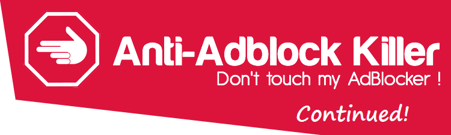

# Anti-Adblock Killer Continued

### Let's revive our beloved Anti-Adblock Killer! 

### Beta test! Let us know what works / doesn't work

### We are looking for contributors! Head over to Issues page and let me know. 

## Installation Instruction

#### Are you using Chrome, uBlock Origin, and Violentmonkey? Check out [uBlock Protector](https://jspenguin2017.github.io/uBlockProtector/)! 

uBlock Protector is an optimized and polished version of AAK-Cont, however, in the process of optimizing the code, it ends up only working on one specific setup. 
If you are not using that setup and you are unwilling to switch, please **DO NOT** try it. It will NOT work and you will NOT find the support that you need. 

The performance difference might be noticable on some really old devices, as technology progresses, this is less and less of an issue. 

#### Step 1: Install Script Host
*  [Tampermonkey](https://chrome.google.com/webstore/detail/tampermonkey/dhdgffkkebhmkfjojejmpbldmpobfkfo) or [Violentmonkey](https://chrome.google.com/webstore/detail/violentmonkey/jinjaccalgkegednnccohejagnlnfdag)
*  [Tampermonkey](https://addons.opera.com/extensions/details/tampermonkey-beta/) or [Violentmonkey](https://addons.opera.com/extensions/details/violent-monkey/) 
*  [Tampermonkey](https://addons.mozilla.org/firefox/addon/tampermonkey/) or [Violentmonkey](https://addons.mozilla.org/en-US/firefox/addon/violentmonkey/)
*  [Tampermonkey](https://safari.tampermonkey.net/tampermonkey.safariextz)
*  [Tampermonkey](https://www.microsoft.com/store/p/tampermonkey/9nblggh5162s)

> ##### Note: After installation (which may require restarting your browser), you are now ready to install userscripts. 

#### Step 2: Install Userscript
* [Click here to install](https://gitlab.com/xuhaiyang1234/AAK-Cont/raw/master/source/aak-cont-script.user.js)

> ##### Note: [Test: BlockAdBlock](https://blockadblock.com/) [Test: Antiblock](http://antiblock.org/?p=v3&demo)

#### Step 3: Add Filter List
* [Subscribe from GitLab](https://xuhaiyang1234.gitlab.io/AAK-Cont/index.html#filterlist)

> ##### Note: Please first check your Adblocker settings page to see if the filter is listed. 
> ##### Note: Extension filters runs alongside core. 

## We need your help! 

This is a Merge Request driven community effort to bring back our beloved Anti-Adblock Killer. 

Every new solution are required to be "stand alone" (only change one file), so every part of this project can work alone. 
I know that the solutions won't be complete this way, but it is better than causing more breakage due to partial installation. 
One of the goal of this project is fit the need of everyone, we need to try to accommodate people who do not want to use the Userscript for example. 

White listing is not ideal, but in the case of AdBlock and Adblock Plus, there may not be an alternative. 
Please put those filters in the AdBlock / Adblock Plus extension filter so other users won't need to watch ads. 

Please make resonable effort to make Userscript rules compatible with Greasemonkey. This is not as big of a priority since FireFox is dropping support 
for legacy plugins like Greasemonkey. 

Version number **must** be a valid float point number with 3 digits after the decimal place. This restriction is due to a limitation in the Userscript. 
Also the Userscript has version number in two different places, please update both. 

Code submitted to Merge Request will go over minimal review before being merged, your requestes will be processed fast. 
One obvious drawback is that the merge can break the code. You may be blocked from submitting new Merge Request if your code is constantly causing problems. 

**If you attempt to submit malicious code, you will be immediately and permanently banned.**

Are you a reputable developer who code a lot and want to directly write to the repository? Let me know and I will give you write access. 
Some critical files are protected (locked) and you must ask me to change them (please open an issue in this case). 

## Features
* Detect & Kill Anti-Adblockers
* More filters for Adblockers
* [Settings](https://xuhaiyang1234.gitlab.io/AAK-Cont/)
* [Suggest features](https://gitlab.com/xuhaiyang1234/AAK-Cont/issues)

## Help
* Check if you have only one Adblocker enabled. (AdBlock, Adblock Plus, uBlock Origin, Adguard, etc...).
* Check if the script manager is enabled (Tampermonkey, Violentmonkey, Greasemonkey, etc...).
* Check if you have installed the latest version of AAK-Cont Script (Step 2).
* Check if you have subscribed to AAK-Cont filter lists (Step 3).
* Check if AAK-Cont Script is enabled.
* Check if AAK-Cont filter lists are enabled.
* Try update or re-install AAK-Cont Script.
* Try update or re-subscribe AAK-Cont filter lists.
* Check if you have another userscript that might interfere with AAK-Cont (e.g. AdBlock Protector, the original (discontinued) AAK).
* One of these extensions is problematic (Disable Anti-Adblock, Ghostery, Online Security Avast, Donotrackme, Privacy Badger, Disconnect, Blur, 
TrackerBlock, Kaspersky Anti-Banner, Freebox (Anti-pub), No Script, YesScript, HTTPS Everywhere). Check if you have it installed.
* Check if, your JavaScript is enabled [Test](http://activatejavascript.org/).
* Remove duplicates AAK-Cont Script / filter lists.
* Remove or disable personal filters.
* Enable only the filter lists you need, too many can make your browser unresponsive.
* Force an update in Adblocker settings.
* Force an update in Script Host settings.
* Try with another Browser or Script Host. Don't want to switch? [Open an issue](https://gitlab.com/xuhaiyang1234/AAK-Cont/issues) and let us know.
* How write Adblock filters [here](https://adblockplus.org/en/filters)
* Where can report an advertisement [here](https://forums.lanik.us/)
* A website does not work? Please report it [here](https://gitlab.com/xuhaiyang1234/AAK-Cont/issues)
* Need help with installation? Ask for help [here](https://gitlab.com/xuhaiyang1234/AAK-Cont/issues)

## Supported Browsers
*  Chrome &#10004;
*  Opera &#10004;
*  FireFox &#10004;
*  Safari &#10004;
*  Edge &#10004;

## Supported Adblockers
* AdBlock &#10004;
* Adblock Plus &#10004;
* uBlock Origin &#10004;
* Adguard ❔

## Anti-Adblock scripts that we kill
##### Plugins (Website)
* Antiblock.org V2 & V3
* AntiAdblock (ClemensConrads)
* AntiAdblock (ErikSwan)
* AntiAdblock (D3xt3r)
* RTK Anti Adblock
* Anti Ad Buster
* AADB Anti Ads Blocker
* AdUnBlock Free & Premium
* FuckAdBlock / BlockAdBlock (Sitexw)
* ABT - Ad Block Test
* Block Adblock (thepcspy.com)
* Remove Adblock (removeadblock.com)
* Adblock Detector
* StopAdBlock (stopadblock.org)
* No-Adblock (no-adblock.com)
* AdBuddy
* AdBlockConverter (adblockconverter.com)
* HowToRemoveAdblock (howtoremoveadblock.com)
* BlockAdblock (blockadblock.com)
* TryMask (trymask.com)

##### Plugins (Wordpress)
* AdBlock Blocker
* No Adblock (noadblock.com)
* AdBlock Alerter
* BlockAlyzer - Adblock counter
* Ad Blocking Detector
* AntiBlock (BukssaAyman)
* AdBlock Notify
* WPAdBlock
* Sorry AdBlocker
* FeatureBlock
* DeAdblocker
* NoAdblock Nice Message
* Ad Block Defender
* Ad Blocking Advisor

##### And more! 

## Like this project?
* Let your friends know
* Report issues
* Help us resolve issues
* Leave a star
